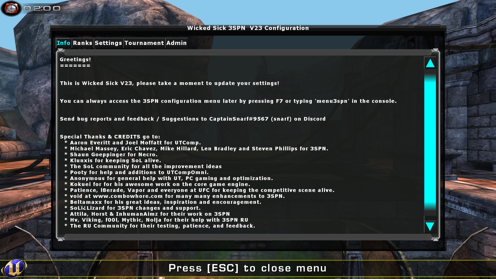
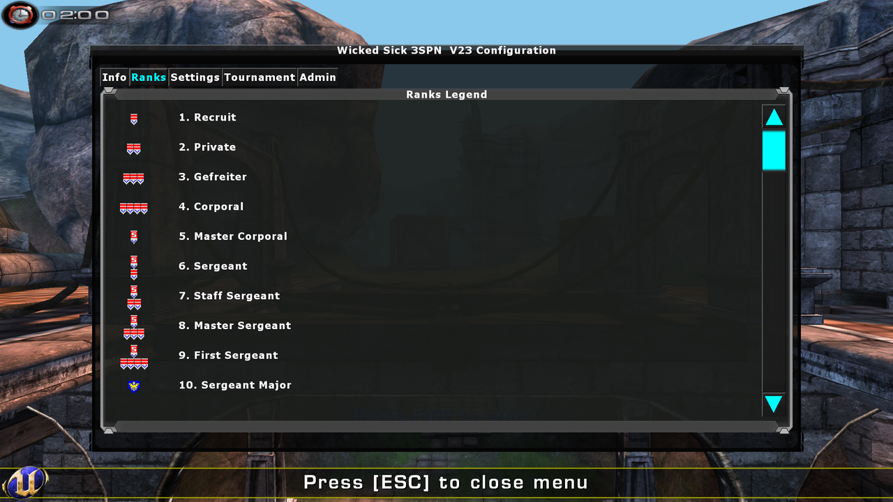
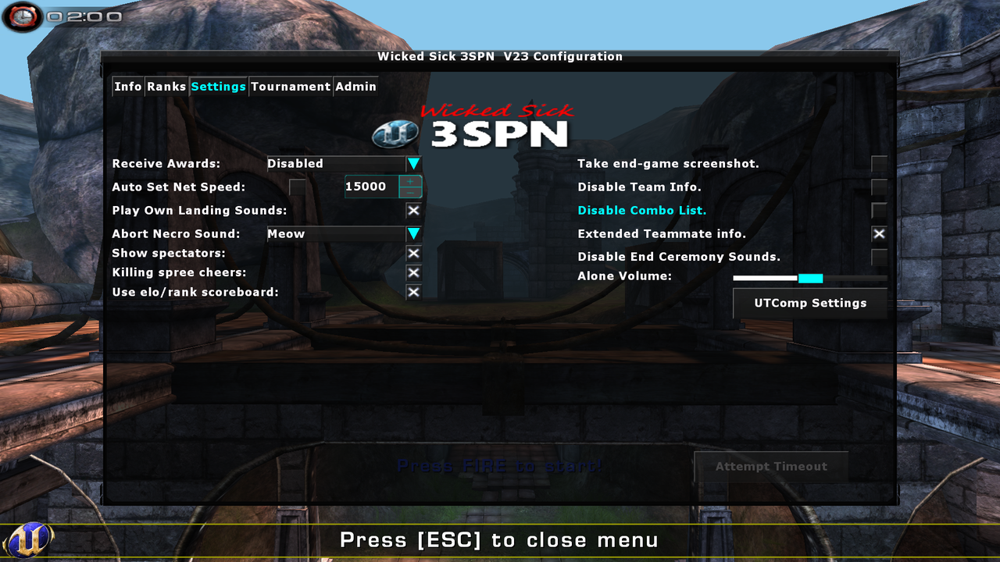
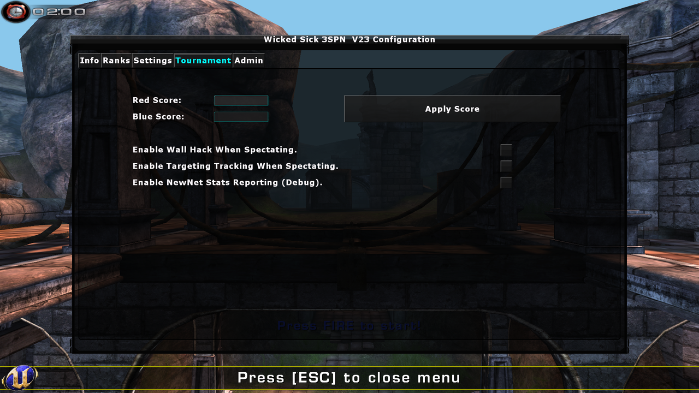
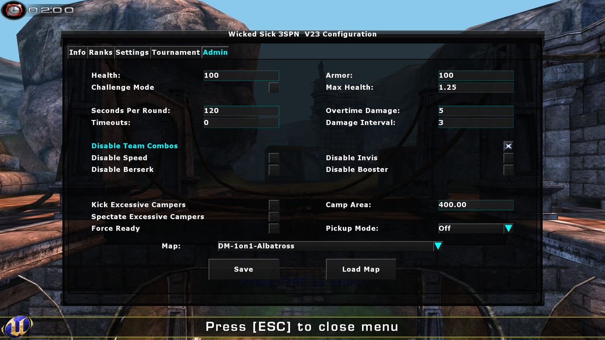

# WS3SPN Player Guide

This guide explains every option in the in‑game **Wicked Sick 3SPN** configuration
menu. The menu is added by the WS3SPN game modes — **TeamArenaMaster (TAM)**,
**ArenaMaster (AM)**, and **Freon** — which build on top of WSUTComp. It lets you tune
3SPN‑specific settings such as awards, HUD info, sounds, and (for admins) the round and
server rules. Your personal choices are saved to your local `WS3SPN.ini`, so they
persist between matches and servers.

## Opening the menu

Press **F7** to open the 3SPN menu, or type `menu3spn` in the console. Press **ESC** to
close it at any time. Most changes are applied and saved immediately as you make them —
there is no separate "save" button on the personal tabs.

> This menu is separate from the **UTComp** menu (opened with **F5**), which handles
> skins, crosshairs, hitsounds, and the like. The two work together — the 3SPN menu even
> has a **UTComp Settings** button that jumps straight to it. See the WSUTComp Player
> Guide for those options.

## The tab bar

Every screen shares the same row of tabs across the top. The title bar shows the version
(e.g. **Wicked Sick 3SPN V23 Configuration**).

| Tab | What it does | Who sees it |
|-----|--------------|-------------|
| **Info** | Welcome text, credits, and how to reopen the menu | Everyone |
| **Ranks** | Legend of the 30 rank icons used by the Elo/rank scoreboard | Everyone |
| **Settings** | Your personal preferences (awards, sounds, HUD, netspeed) | Everyone |
| **Tournament** | Manually set team scores; spectator wall‑hack / tracking | **Admins only** |
| **Admin** | Server/round rules — health, armor, round time, combos, camping, map | **Admins only** |

The **Tournament** and **Admin** tabs are only added when you are logged in as an admin
(or playing standalone). If you are not an admin, their controls stay hidden or greyed
out.

---

## Info

A read‑only welcome page. It greets you, reminds you that the menu can be reopened with
**F7** or the `menu3spn` console command, points you to where to send bug reports
(CaptainSnarf / snarf on Discord), and lists the **Special Thanks & Credits** for
everyone who contributed to UTComp, 3SPN, Necro, and this Wicked Sick build. Use the
scroll bar on the right to read the full credits.

---

## Ranks

A legend that maps each **rank icon** to its title. WS3SPN can show an Elo/rank based
scoreboard (see **Use elo/rank scoreboard** on the Settings tab); this tab is the key to
what those little insignia mean. There are **30 ranks**, from **1. Recruit** up through
**30. Generalissimo** (Private, Corporal, Sergeant, the Warrant Officer and Lieutenant
tiers, Captain, Major, Colonel, General, and so on). Scroll with the bar on the right to
see all 30.

---

## Settings

Your personal preferences. Everything here is saved to your local config and takes effect
immediately. The controls are split into a left column and a right column.

### Left column

- **Receive Awards** (drop‑down) — Whose award announcements you see/hear:
  - **Disabled** — no award messages.
  - **Player** — only your own awards.
  - **Team** — your awards and your teammates'.
  - **All** — everyone's awards.
- **Auto Set Net Speed** (check box + value) — When checked, WS3SPN forces your netspeed
  to the value in the box (default **15000**) each time you connect, so you don't have to
  set it manually. Type the desired netspeed in the field beside it.
- **Play Own Landing Sounds** — Hear your own landing/footstep‑style landing sounds.
- **Abort Necro Sound** (drop‑down) — The sound played when a Necro adrenaline
  transformation is aborted: **None**, **Meow**, **Buzz**, or **Fart**.
- **Show spectators** — Show the spectator count on the HUD. (Only appears when the
  server has spectator‑count display enabled.)
- **Killing spree cheers** — Play the crowd/announcer cheers on killing sprees.
- **Use elo/rank scoreboard** — Switch the scoreboard to the Elo/rank style that shows
  each player's rank insignia (see the **Ranks** tab for the legend).

### Right column

- **Take end‑game screenshot** — Automatically capture a screenshot at the end of each
  match.
- **Disable Team Info** — Hide the on‑HUD list of team members and enemies.
- **Disable Combo List** — Hide the adrenaline‑combo info panel in the lower‑right of the
  HUD.
- **Extended Teammate info** — Show extra teammate detail (health and location name) in
  the team info panel.
- **Disable End Ceremony Sounds** — Silence the end‑of‑match ceremony sounds.
- **Alone Volume** (slider) — Volume of the "you are the last one alive" sound cue
  (0 – 2×).

### Buttons

- **UTComp Settings** — Closes this menu and opens the UTComp (F5) menu.
- **Attempt Timeout** — Calls a timeout (in modes/servers that allow them). Disabled for
  non‑admins when the server has no timeouts configured. Using it closes the menu.

---

## Tournament *(admins only)*

Match‑management tools for admins running a tournament or scrim. Non‑admins see this tab
greyed out.

**Manual scoring**

- **Red Score** / **Blue Score** — Type the score you want each team to have.
- **Apply Score** — Push those scores to the server (useful for correcting the score
  after a misplay or restoring a score after a crash).

**Spectator tools** (check boxes)

- **Enable Wall Hack When Spectating** — See players through walls while spectating.
- **Enable Targeting Tracking When Spectating** — Draw targeting/tracking lines to
  players while spectating.
- **Enable NewNet Stats Reporting (Debug)** — Report enhanced‑netcode statistics for
  debugging. Leave off for normal play.

---

## Admin *(admins only)*

The server/round rule set. Change any value, then press **Save** to send the settings to
the server — **they take effect on the next map/round**. Non‑admins see everything greyed
out.

> The Admin tab comes in two variants. In **team** games (TeamArenaMaster / Freon) it is
> the TAM version shown above, which adds **Disable Team Combos**. In non‑team
> **ArenaMaster**, that one option is absent; everything else is the same.

**Health & armor**

- **Health** — Base health players spawn with each round.
- **Armor** — Base armor players spawn with each round.
- **Challenge Mode** — Round winners take a health/armor penalty the next round (a
  handicap for the leader).
- **Max Health** — The cap on health/armor as a **multiplier of the starting value**
  (e.g. `1.25` with 100 health = a 125 cap for pickups/boosts).

**Round & overtime**

- **Seconds Per Round** — Round time limit before overtime begins (default **120**).
- **Timeouts** — Number of timeouts each team is allowed (see **Attempt Timeout** on the
  Settings tab).
- **Overtime Damage** — Amount of damage dealt to all players once overtime starts.
- **Damage Interval** — How often (in seconds) that overtime damage is applied.

**Adrenaline combos** (check to disable)

- **Disable Team Combos** *(team modes only)* — Team combos affect only the user, not the
  whole team.
- **Disable Speed** — Turn off the Speed combo.
- **Disable Invis** — Turn off the Invisibility combo.
- **Disable Berserk** — Turn off the Berserk combo.
- **Disable Booster** — Turn off the Booster combo.

**Anti‑camp**

- **Kick Excessive Campers** — Kick a player who camps 4 consecutive times.
- **Spectate Excessive Campers** — Instead of kicking, move a 4‑time camper to spectator.
- **Camp Area** — The radius a player must stay within to be counted as camping
  (default **400**).

**Other**

- **Force Ready** — Force players to ready up after ~45 seconds during warmup.
- **Pickup Mode** (drop‑down) — Spawns three pickups that give a random effect when
  grabbed (Health +10/20, Shield +10/20, or Adren +10):
  - **Off** — no extra pickups.
  - **Random** — placed randomly.
  - **Optimal** — placed at optimal spots.

**Map controls** (bottom)

- **Map** (drop‑down) — Pick a map from the server's rotation.
- **Save** — Send the settings above to the server (applied next map/round).
- **Load Map** — Immediately switch the server to the selected map.

---

*This guide reflects the options built by `Menu_Settings`, `Menu_TabInfo`,
`Menu_TabRanks`, `Menu_TabTournamentAdmin`, and `Menu_TabTAMAdmin` / `Menu_TabAMAdmin`,
stored in `Misc_Player` (personal settings) and the game's `TAM_GRI` (server/round
settings). Admin‑only tabs and some options depend on your login and the game mode in
play.*
