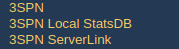
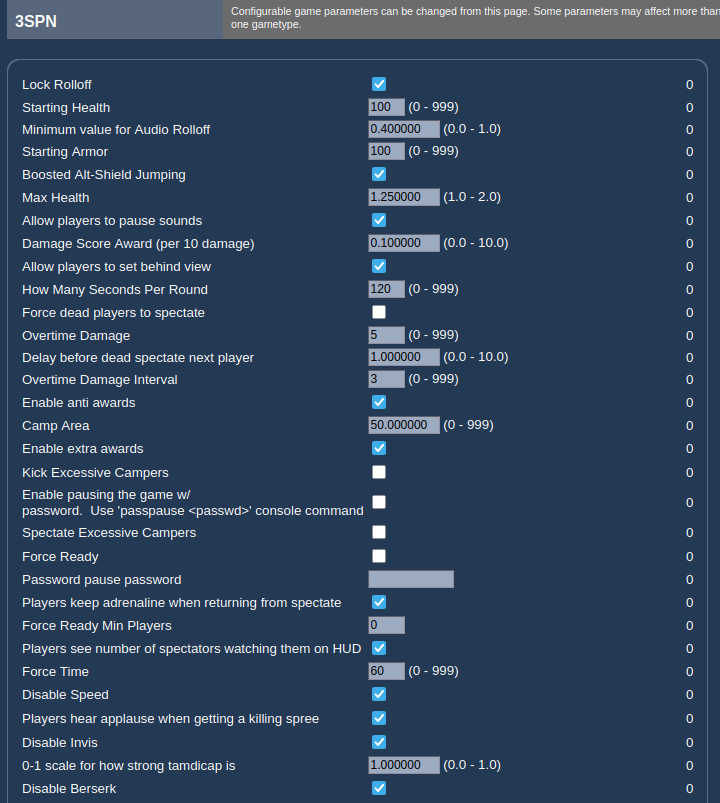
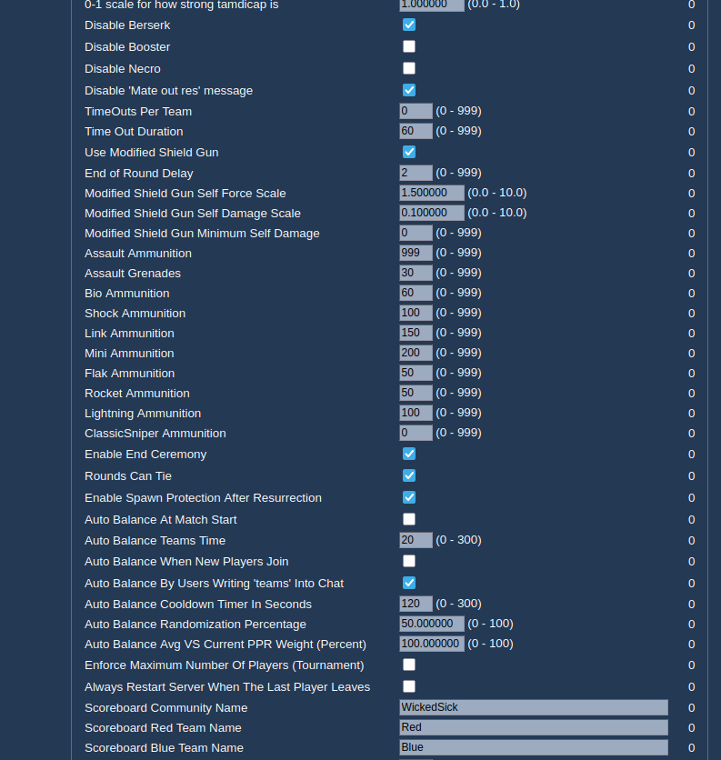
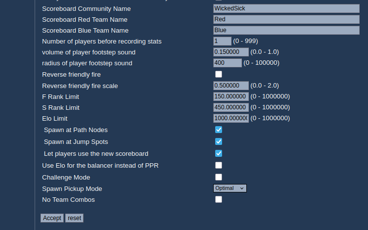
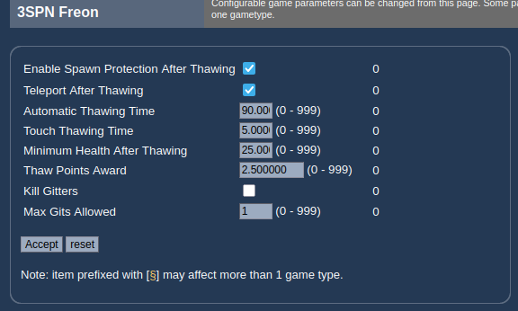
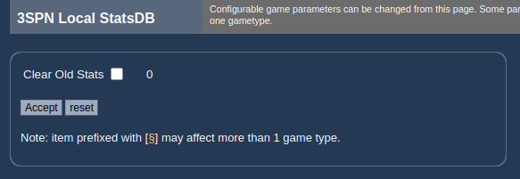
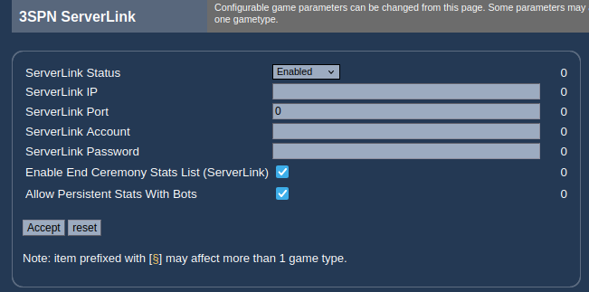

# WS3SPN Server Operator Guide

This guide documents every server‑side setting exposed by the **WS3SPN** game modes —
**TeamArenaMaster (TAM)**, **Freon**, and **ArenaMaster (AM)**. These are the options built
in each game mode's `FillPlayInfo` call, so they appear in **WebAdmin** (and any other
UT2004 settings UI) under the gametype's configuration, and can also be set directly in
the game mode's section of the server's `UT2004.ini`
(`[WS3SPN.TeamArenaMaster]`, `[WS3SPN.Freon]`, `[WS3SPN.ArenaMaster]`).

> These are **game‑mode** settings, distinct from the **WSUTComp mutator** settings
> (`[WSUTComp.MutUTComp]`) covered by the WSUTComp Server Operator Guide. Because the TAM
> game modes derive from `MutUTComp`, a WS3SPN server has **both** sets of pages in
> WebAdmin.

## Where to find these settings

In WebAdmin, open the gametype's configuration. WS3SPN splits its options across several
pages, listed in the sidebar:

| Page | Covers |
|------|--------|
| **3SPN** | All core round/match rules: health & armor, round timing, adrenaline combos, camping, weapon ammo, auto‑balance, scoreboard, awards, and more |
| **3SPN Freon** | Freon‑only thawing rules *(only on the Freon game type)* |
| **3SPN Local StatsDB** | Maintenance of the on‑server persistent stats database |
| **3SPN ServerLink** | Connection to a remote ServerLink stats/PPR service |

> The **3SPN Freon** page is added only when running the **Freon** game type (Freon derives
> from TeamArenaMaster, so a Freon server has all four pages; TAM and AM servers have the
> other three).

Each row corresponds to a `config` property on the game mode; the property name is listed
in the tables below so you can edit `UT2004.ini` directly if you prefer.

> **The number on the right of each WebAdmin row is the required admin access level**, not
> a value.
>
> **The values in the screenshots are one server's configuration**, not the out‑of‑the‑box
> defaults. The "Default" column below lists each property's built‑in default.
>
> **The 3SPN page is long.** The screenshots below are three scrolled captures of the same
> page. WebAdmin interleaves the options by internal weight, so its on‑screen order differs
> from the logical grouping used here.

---

## 3SPN — the main configuration page

This page differs slightly by game mode. The tables below document the full **team‑mode**
set (TeamArenaMaster / Freon). Non‑team **ArenaMaster** exposes the same core options but
omits the team‑only ones (No Team Combos, Auto Balance, scoreboard team names, Elo
balancer, etc.).

### Health & armor

| Setting | Property | Type | Default | Notes |
|---------|----------|------|---------|-------|
| Starting Health | `StartingHealth` | Text (0–999) | 100 | Base health at round start. |
| Starting Armor | `StartingArmor` | Text (0–999) | 100 | Base armor at round start. |
| Max Health | `MaxHealth` | Text (1.0–2.0) | 1.25 | Cap on health/armor as a **multiplier of the starting value** (e.g. 1.25 × 100 = 125). |
| Challenge Mode | `bChallengeMode` | Check | Off | Round winners take a health/armor penalty the next round. |
| 0‑1 scale for how strong tamdicap is | `ChallengeModeScale` | Text (0.0–1.0) | 1.0 | Strength of the Challenge‑Mode handicap. |
| Damage Score Award (per 10 damage) | `ScoreAwardPer10Damage` | Text (0.0–10.0) | 0.1 | Score awarded per 10 points of damage dealt. |

### Round & overtime

| Setting | Property | Type | Default | Notes |
|---------|----------|------|---------|-------|
| How Many Seconds Per Round | `SecsPerRound` | Text (0–999) | 120 | Round time limit before overtime. |
| Overtime Damage | `OTDamage` | Text (0–999) | 5 | Damage applied to all players during overtime. |
| Overtime Damage Interval | `OTInterval` | Text (0–999) | 3 | How often (seconds) overtime damage is applied. |
| End of Round Delay | `EndOfRoundDelay` | Text (0–999) | 2 | Delay in seconds between rounds. |
| Rounds Can Tie | `RoundCanTie` | Check | On | Allow a round to end in a tie. |
| Enable End Ceremony | `EndCeremonyEnabled` | Check | On | Play the end‑of‑match ceremony. |

### Ready‑up / warmup

| Setting | Property | Type | Default | Notes |
|---------|----------|------|---------|-------|
| Force Ready | `bForceRUP` | Check | On | Force players to ready up after a set time. |
| Force Ready Min Players | `ForceRUPMinPlayers` | Text (0–999) | 0 | Only force‑ready when at least this many players are present. |
| Force Time | `ForceSeconds` | Text (0–999) | 60 | Seconds players have to ready up before the game auto‑starts. |

### Timeouts

| Setting | Property | Type | Default | Notes |
|---------|----------|------|---------|-------|
| TimeOuts Per Team | `Timeouts` | Text (0–999) | 0 | Number of timeouts each team may call per game. |
| Time Out Duration | `TimeOutDuration` | Text (0–999) | 60 | Length of a timeout in seconds. |

### Adrenaline combos (check to disable)

| Setting | Property | Type | Default | Notes |
|---------|----------|------|---------|-------|
| No Team Combos *(team modes only)* | `bDisableTeamCombos` | Check | Off | Team combos affect only the user, not the whole team. |
| Disable Speed | `bDisableSpeed` | Check | Off | Disable the Speed combo. |
| Disable Invis | `bDisableInvis` | Check | Off | Disable the Invisibility combo. |
| Disable Berserk | `bDisableBerserk` | Check | Off | Disable the Berserk combo. |
| Disable Booster | `bDisableBooster` | Check | Off | Disable the Booster combo. |
| Disable Necro | `bDisableNecro` | Check | On | Disable the Necro combo. |
| Disable 'Mate out res' message | `bDisableNecroMessage` | Check | On | Suppress the Necro resurrection message. |

### Anti‑camp

| Setting | Property | Type | Default | Notes |
|---------|----------|------|---------|-------|
| Camp Area | `CampThreshold` | Text (0–999) | 400 | Radius a player must stay within to count as camping. |
| Kick Excessive Campers | `bKickExcessiveCampers` | Check | On | Kick a player who camps 4 consecutive times. |
| Spectate Excessive Campers | `bSpecExcessiveCampers` | Check | On | Move a 4‑time camper to spectator instead of kicking. |

### Pickups & spawns

| Setting | Property | Type | Default | Notes |
|---------|----------|------|---------|-------|
| Spawn Pickup Mode | `PickupMode` | Select | Off (0) | Spawns three random‑effect pickups (Health +10/20, Shield +10/20, Adren +10). `0` Off, `1` Random, `2` Optimal. |
| Enable Spawn Protection After Resurrection | `bSpawnProtectionOnRez` | Check | On | Give spawn protection to resurrected players (Freon). |
| Spawn at Path Nodes | `bSpawnAtPathNodes` | Check | On | Allow spawning at path nodes. |
| Spawn at Jump Spots | `bSpawnAtJumpSpots` | Check | On | Allow spawning at jump spots. |

### Modified Shield Gun

| Setting | Property | Type | Default | Notes |
|---------|----------|------|---------|-------|
| Use Modified Shield Gun | `bModifyShieldGun` | Check | Off | Shield Gun gives more kickback for higher shield jumps. |
| Modified Shield Gun Self Force Scale | `ShieldGunSelfForceScale` | Text (0.0–10.0) | 1.5 | Self‑force multiplier. |
| Modified Shield Gun Self Damage Scale | `ShieldGunSelfDamageScale` | Text (0.0–10.0) | 0.1 | Self‑damage multiplier (1.0 = 20 damage). |
| Modified Shield Gun Minimum Self Damage | `ShieldGunMinSelfDamage` | Text (0–999) | 0 | Minimum self‑damage generated. |

### Weapon ammunition (per round)

Amount of ammo each weapon is given at the start of a round.

| Setting | Property | Type | Default |
|---------|----------|------|---------|
| Assault Ammunition | `AssaultAmmo` | Text (0–999) | 999 |
| Assault Grenades | `AssaultGrenades` | Text (0–999) | 5 |
| Bio Ammunition | `BioAmmo` | Text (0–999) | 20 |
| Shock Ammunition | `ShockAmmo` | Text (0–999) | 20 |
| Link Ammunition | `LinkAmmo` | Text (0–999) | 100 |
| Mini Ammunition | `MiniAmmo` | Text (0–999) | 75 |
| Flak Ammunition | `FlakAmmo` | Text (0–999) | 12 |
| Rocket Ammunition | `RocketAmmo` | Text (0–999) | 12 |
| Lightning Ammunition | `LightningAmmo` | Text (0–999) | 10 |
| ClassicSniper Ammunition | `ClassicSniperAmmo` | Text (0–999) | 10 |

### Auto‑balance *(team modes only)*

| Setting | Property | Type | Default | Notes |
|---------|----------|------|---------|-------|
| Auto Balance At Match Start | `AutoBalanceTeams` | Check | Off | Balance teams when the match starts. |
| Auto Balance Teams Time | `AutoBalanceSeconds` | Text (0–300) | 20 | Delay before the match‑start balance runs. |
| Auto Balance When New Players Join | `AutoBalanceOnJoins` | Check | Off | Re‑balance as players join. |
| Auto Balance By Users Writing 'teams' Into Chat | `AllowForceAutoBalance` | Check | On | Let players trigger a balance by typing `teams` (admins always can). |
| Auto Balance Cooldown Timer In Seconds | `ForceAutoBalanceCooldown` | Text (0–300) | 120 | Cooldown between chat‑triggered balances. |
| Auto Balance Randomization Percentage | `AutoBalanceRandomization` | Text (0–100) | 50 | Randomization applied when balancing. |
| Auto Balance Avg VS Current PPR Weight (Percent) | `AutoBalanceAvgPPRWeight` | Text (0–100) | 100 | Weight of average PPR vs. current PPR when balancing. |
| Enforce Maximum Number Of Players (Tournament) | `EnforceMaxPlayers` | Check | Off | Enforce a hard player cap for tournament play. |

### Ranking & scoreboard

| Setting | Property | Type | Default | Notes |
|---------|----------|------|---------|-------|
| Scoreboard Community Name | `ScoreboardCommunityName` | Text | "Community" | Community name shown on the scoreboard. |
| Scoreboard Red Team Name | `ScoreboardRedTeamName` | Text | "Red" | Custom Red team name. |
| Scoreboard Blue Team Name | `ScoreboardBlueTeamName` | Text | "Blue" | Custom Blue team name. |
| Let players use the new scoreboard | `bUseNewScoreboard` | Check | On | Allow the Elo/rank scoreboard. |
| Use Elo for the balancer instead of PPR | `bUseEloBalancer` | Check | Off | Balance by Elo rather than PPR. |
| F Rank Limit | `FRankLimit` | Text (0–1000000) | 150 | Elo value needed for F rank. |
| S Rank Limit | `SRankLimit` | Text (0–1000000) | 450 | Elo value needed for S rank. |
| Elo Limit | `EloLimit` | Text (0–1000000) | 1000 | Elo scale (maximum Elo). |
| Number of players before recording stats | `MinPlayersForStatsRecording` | Text (0–999) | 2 | Minimum players present before stats are recorded. |

### Awards, sounds & spectating

| Setting | Property | Type | Default | Notes |
|---------|----------|------|---------|-------|
| Enable anti awards | `bEnableAntiAwards` | Check | On | Enable the "anti" (negative) awards. |
| Enable extra awards | `bEnableExtraAwards` | Check | On | Enable the extra award set (combo king, shock therapy, etc.). |
| Players hear applause when getting a killing spree | `bCheersForSprees` | Check | On | Crowd cheers on killing sprees. |
| Lock Rolloff | `bLockRolloff` | Check | On | Lock the audio rolloff value. |
| Minimum value for Audio Rolloff | `RolloffMinValue` | Text (0.0–1.0) | 0.4 | Minimum sound rolloff. |
| Allow players to pause sounds | `bAllowPauseSounds` | Check | On | Let players pause sounds client‑side. |
| volume of player footstep sound | `FootstepVolume` | Text (0.0–1.0) | 0.15 | Footstep sound volume. |
| radius of player footstep sound | `FootstepRadius` | Text (0–100000) | 400 | Footstep audible radius. |
| Boosted Alt‑Shield Jumping | `bBoostedAltShieldJump` | Check | Off | Stronger alt‑fire shield jumps. |
| Allow players to set behind view | `bAllowSetBehindView` | Check | On | Permit 3rd‑person behind view. |
| Force dead players to spectate | `bForceDeadToSpectate` | Check | Off | Send dead players straight to spectator. |
| Delay before dead spectate next player | `ForceDeadSpectateDelay` | Text (0.0–10.0) | 1.0 | Delay before a dead spectator moves to the next player. |
| Players keep adrenaline when returning from spectate | `bSpecsKeepAdren` | Check | On | Preserve adrenaline across spectate. |
| Players see number of spectators watching them on HUD | `bShowNumSpecs` | Check | On | Show spectator count on the HUD. |

### Friendly fire

| Setting | Property | Type | Default | Notes |
|---------|----------|------|---------|-------|
| Reverse friendly fire | `bPureRFF` | Check | Off | Teammate damage is reflected back at the shooter. |
| Reverse friendly fire scale | `PureRFFScale` | Text (0.0–2.0) | 0.5 | Scale of reflected‑back damage. |

### Server management

| Setting | Property | Type | Default | Notes |
|---------|----------|------|---------|-------|
| Always Restart Server When The Last Player Leaves | `AlwaysRestartServerWhenEmpty` | Check | Off | Restart the server when it empties. |
| Enable pausing the game w/password | `bEnablePasswordPause` | Check | Off | Allow `passpause <passwd>` to pause the game. |
| Password pause password | `PasswordPausePassword` | Text | *(empty)* | Password used by the pause command. |

---

## 3SPN Freon *(Freon game type only)*

Thawing rules specific to **Freon**, where frozen teammates are revived by touching their
ice statue. This page appears only when the server is running Freon.

| Setting | Property | Type | Default | Notes |
|---------|----------|------|---------|-------|
| Enable Spawn Protection After Thawing | `bSpawnProtectionOnThaw` | Check | On | Give a thawed player brief spawn protection. |
| Teleport After Thawing | `TeleportOnThaw` | Check | On | Teleport the thawed player to the reviving teammate. |
| Automatic Thawing Time | `AutoThawTime` | Text (0–999) | 60 | Seconds before a frozen player auto‑thaws on their own. |
| Touch Thawing Time | `ThawSpeed` | Text (0–999) | 5 | Seconds of contact needed to thaw a teammate. |
| Minimum Health After Thawing | `MinHealthOnThaw` | Text (0–999) | 25 | Health a player is given on being thawed. |
| Thaw Points Award | `ThawPointAward` | Text (0–999) | 2.5 | Score awarded for thawing a teammate. |
| Kill Gitters | `KillGitters` | Check | Off | Kill players who "git" (exploit stacking on statues) too much. |
| Max Gits Allowed | `MaxGitsAllowed` | Text (0–999) | 1 | Allowed number of gits before action is taken. |

---

## 3SPN Local StatsDB

Maintenance for the on‑server persistent stats database (stored in the mode's
`WS3SPN_Stats*.ini` file, e.g. `WS3SPN_StatsFreon.ini`), which feeds the Elo/rank
scoreboard.

| Setting | Property | Type | Default | Notes |
|---------|----------|------|---------|-------|
| Clear Old Stats | `ClearOldStats` | Check | Off | Clear stats older than 24 hours. |

> The note *"item prefixed with [§] may affect more than 1 game type"* is a stock WebAdmin
> hint, not a WS3SPN setting.

---

## 3SPN ServerLink

Connects the server to a remote **ServerLink** service that stores persistent stats and
supplies average PPR values used for team balancing.

| Setting | Property | Type | Default | Notes |
|---------|----------|------|---------|-------|
| ServerLink Status | `ServerLinkStatus` | Select | Enabled | `Disabled`, `ReadOnly` (only fetch AVG PPR for balancing), or `Enabled` (full read/write). |
| ServerLink IP | `ServerLinkAddress` | Text | *(empty)* | Address of the ServerLink host. |
| ServerLink Port | `ServerLinkPort` | Text | 0 | ServerLink port. |
| ServerLink Account | `ServerLinkAccount` | Text | *(empty)* | Account name for authentication. |
| ServerLink Password | `ServerLinkPassword` | Text | *(empty)* | Account password. |
| Enable End Ceremony Stats List (ServerLink) | `EndCeremonyStatsEnabled` | Check | On | Show the ServerLink stats list at the end ceremony. |
| Allow Persistent Stats With Bots | `AllowPersistentStatsWithBots` | Check | Off | Record persistent stats even when bots are present. |

---

*This guide reflects the settings registered by `Team_GameBase.FillPlayInfo` (with the
team‑only additions from `TeamArenaMaster`), stored as `config` properties on the game
mode. Values shown in the screenshots are illustrative; the Default column lists each
property's built‑in default. Non‑team ArenaMaster exposes a subset of the 3SPN page. Some
settings take effect on the next map or round.*
